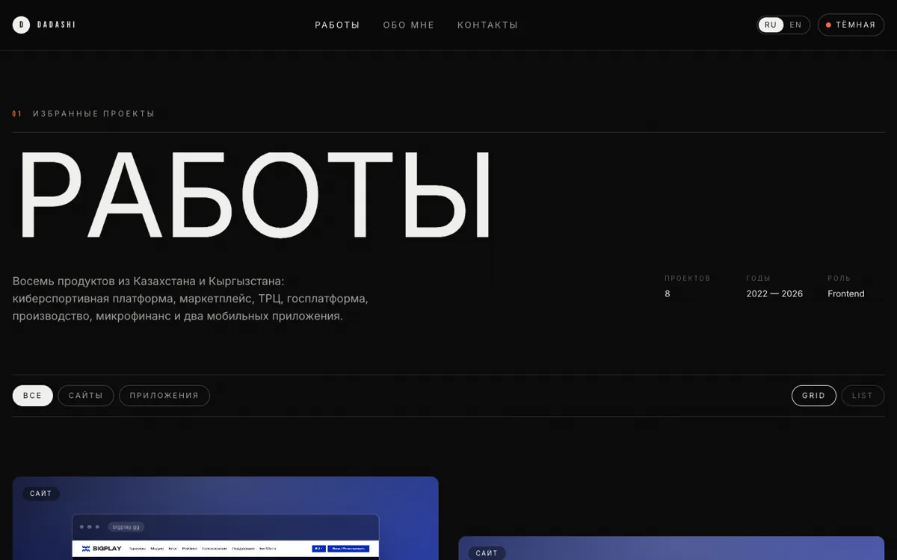
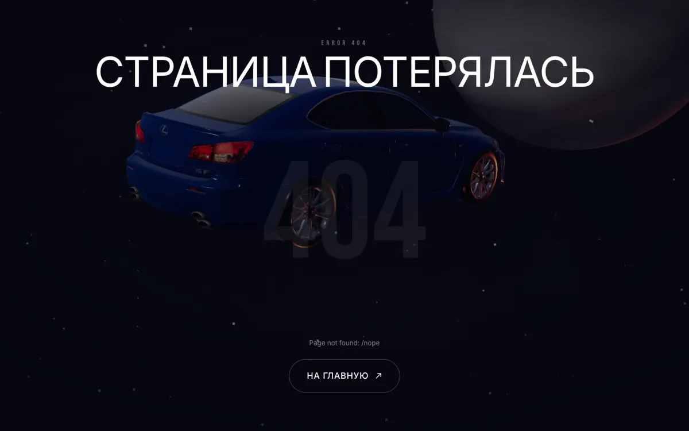

# Разработка

Технические детали проекта: стек, структура, анимации, локализация, SEO,
страницы ошибок и подготовка ассетов. Обзор проекта — в [README](README.md).

## Стек

| Слой | Что используется |
| --- | --- |
| Фреймворк | Nuxt 4 (SSR), Vue 3, TypeScript |
| Анимация | GSAP 3.15 — ScrollTrigger, SplitText, ScrollToPlugin, quickTo |
| Скролл | Lenis (smooth scroll, синхронизирован с `gsap.ticker` и ScrollTrigger) |
| Стили | Tailwind CSS 3 (`@nuxtjs/tailwindcss`), CSS-переменные для тем |
| Шрифты | `@nuxt/fonts` — Inter + Bebas Neue |
| Локализация | `@nuxtjs/i18n` — RU (по умолчанию) и EN |
| Утилиты | `@vueuse/nuxt` |

## Как выглядит

<table>
<tr>
<td width="50%"></td>
<td width="50%"></td>
</tr>
<tr>
<td align="center"><sub>Каталог работ</sub></td>
<td align="center"><sub>404 — сцена на three.js</sub></td>
</tr>
</table>

## Требования

Nuxt 4.5 требует **Node ≥ 22** (в 20.x падает на `Set.prototype.difference`).
Если локально стоит Node 20 — собирайте через Bun:

```bash
bun --bun run build
```

## Команды

```bash
bun install
bun run dev        # http://localhost:5050
bun run build
bun run preview
bun run typecheck
```

## Структура

```
app/
  assets/css/main.css      # темы (CSS-переменные), grain, утилиты
  components/
    ui/                    # AppCursor, ThePreloader, MagneticEl, SplitReveal,
                           # FadeUp, AppMarquee, ArrowLink, ScrollProgress, …
    layout/                # TheHeader, TheMenu, TheFooter
    home/                  # Hero, Intro, Services, WorksShowcase, Stack, ContactCta
    work/                  # WorkCard, WorkRow, ProjectVisual
  composables/
    useMotion.ts           # singleton-доступ к gsap/ScrollTrigger/SplitText/lenis
    useCursor.ts           # состояние кастомного курсора + директива v-cursor
    useTheme.ts            # dark/light, сохраняется в localStorage
    useAppState.ts         # флаги прелоадера и меню
  data/projects.ts         # единственный источник правды по проектам (тексты в {ru, en})
  composables/useProjects.ts  # проекты с уже развёрнутыми под локаль строками
  pages/                   # /, /work, /work/[slug], /about, /contact
  plugins/
    gsap.client.ts         # регистрация плагинов + Lenis
    directives.ts          # v-cursor (с getSSRProps, чтобы не падал SSR)
i18n/locales/{ru,en}.json  # все тексты интерфейса
server/api/contact.post.ts # приём формы → Telegram
```

## Анимации

- **Прелоадер** — счётчик 0→100, приветствия на разных языках, уход `expo.inOut`.
  Играет один раз за сессию (`sessionStorage`), при `prefers-reduced-motion` пропускается.
- **Hero** — посимвольный reveal через SplitText с масками, ротация роли, параллакс видео.
- **Selected work** — горизонтальный пин-скролл на `lg+`, вертикальный список на мобилке.
- **Intro** — пословная подсветка текста на `scrub`.
- **Marquee** — бесшовная лента с ускорением от скорости скролла.
- **Курсор** — свой курсор с режимами (`default / link / view / drag / hidden`) через
  директиву `v-cursor="'view'"` или `v-cursor="{mode:'link', label:'Open'}"`.
  Включается только при `hover: hover` + `pointer: fine` и выключен при reduced-motion;
  нативный курсор прячется только после того, как свой уже отрисован.

Все анимации отключаются через `prefers-reduced-motion: reduce`.

## Проекты

Все кейсы описаны в `app/data/projects.ts`. Превью — не голая картинка, а мокап:
сайты показываются в рамке браузера (шапка проекта всегда видна), приложения —
в рамке телефона, который подстраивается под пропорции скриншота и ничего не режет.

`public/works/`:

| Файл | Что это |
| --- | --- |
| `<slug>.webp` | десктопный скриншот сайта, 1440px, WebP q78 |
| `tumar-mobile.webp`, `hft-mobile.webp` | реальные экраны приложений из App Store |

Компонент `ProjectVisual` сам выбирает файл: для `kind: 'mobile'` он подставляет
`-mobile.webp`. Если поле `image` убрать, рисуется абстрактный мокап в фирменных
цветах проекта — запрос за картинкой при этом не отправляется вообще.

Как сняты десктопные скриншоты (в macOS нет `timeout`, поэтому сторожевой таймер
руками; некоторые WAF режут дефолтный headless-UA — отсюда `--user-agent`):

```bash
"/Applications/Google Chrome.app/Contents/MacOS/Google Chrome" \
  --headless=new --hide-scrollbars --window-size=1600,1000 \
  --user-agent="Mozilla/5.0 (Macintosh; Intel Mac OS X 10_15_7) ... Chrome/141.0.0.0 Safari/537.36" \
  --virtual-time-budget=10000 --user-data-dir=/tmp/shot-profile \
  --screenshot=out.png https://example.com
sips --resampleWidth 1440 out.png && cwebp -q 78 -m 6 out.png -o public/works/example.webp
```

Экраны приложений взяты из листингов App Store:

```bash
curl -s "https://itunes.apple.com/lookup?id=<APP_ID>&country=kz" | jq -r '.results[0].screenshotUrls[]'
# в URL можно заменить сегмент размера: .../392x696bb.jpg → .../1242x2208bb.jpg
```

## Страницы ошибок (404 / 500)

`app/error.vue` — космос со свободно летящей машиной на three.js
(`app/components/ui/SpaceScene.vue`): звёздное поле, туманность, луна,
контровой свет акцентным цветом, параллакс за курсором.

Страница намеренно не использует `ArrowLink` / `MagneticEl` / `v-cursor`:
она должна открываться даже когда приложение сломано, а слотовые компоненты
внутри error-boundary Nuxt ловили `currentRenderingInstance === null` в Safari.

**Машина** — реальная модель Lexus IS F из `public/models/car.glb` (507 КБ).
Если файла нет или он не распарсился, рисуется запасной IS F, собранный кодом:
реальные габариты (4.66 × 1.82 × 1.42 м, база 2.73 м, диски 19") и узнаваемые
детали — сдвоенные выхлопы «этажеркой», жабры на крыле, купол на капоте.

Подготовка модели — `node scripts/optimize-car.mjs [source.glb]`:

| Шаг | Зачем |
| --- | --- |
| Выброс салона | Сиденья, торпедо и руль — 38% треугольников, и их не видно за тонировкой |
| dedup / prune / weld / join | Меньше draw call'ов: было 95 примитивов |
| Текстуры → WebP, 1024 | Было 23 PNG на 1.7 МБ |
| Meshopt | Сжатие геометрии; в загрузчике подключён `MeshoptDecoder` |

Результат: **3.49 МБ → 507 КБ (−86%)**. Исходник в репозитории не хранится.
Повторный прогон по уже сжатому `car.glb` скрипт отклоняет — чтобы не сжимать
сжатое; для перенастройки нужен свежий экспорт.

Боковые и заднее стёкла на загрузке превращаются в глухую тонировку: смотреть
внутрь нечего, и не запускается лишний проход рендера для `transmission`.
Чтобы поставить настоящую модель, положите `.glb` в `public/models/car.glb`:
загрузчик подхватит её и сам отмасштабирует, иначе останется процедурная.
Требования к модели — в `public/models/README.md`.

three.js весит ~630 КБ и нужен только здесь, поэтому:

- компонент подключён как `<LazySpaceScene>` — отдельный чанк;
- хук `build:manifest` в `nuxt.config.ts` снимает с него `prefetch`, иначе Nuxt
  тянул бы этот чанк на всех страницах заранее.

Проверить можно так: на `/`, `/work`, `/about` ссылок на чанк с three быть не должно.

Металлы (диски, хром, краска) освещаются процедурным environment map: без него
`metalness: 1` в тёмной сцене рендерится чёрным. Вся инициализация обёрнута в
try/catch — если WebGL недоступен, останется тёмный фон, но страница откроется.

При `prefers-reduced-motion: reduce` сцена рисуется одним кадром без анимации,
на скрытой вкладке цикл останавливается, при размонтировании геометрии,
материалы, текстуры и рендерер освобождаются.

## SEO и иконки

`NUXT_PUBLIC_SITE_URL` — абсолютный origin деплоя. Он используется в canonical,
`og:url`, `hreflang` и sitemap, поэтому его **обязательно** нужно выставить под
реальный домен (по умолчанию стоит `https://dadashiii.netlify.app`).

| Что | Где |
| --- | --- |
| Мета, canonical, OG, Twitter | `useSiteSeo()` в `app/composables/useSiteSeo.ts` |
| JSON-LD Person + WebSite | `app/app.vue` |
| JSON-LD CreativeWork по кейсу | `app/pages/work/[slug].vue` |
| `robots.txt`, `sitemap.xml` | серверные роуты в `server/routes/` |

Sitemap собирается из статических путей и слагов проектов, по 24 URL — обе
локали с перекрёстными `xhtml:link hreflang`.

Иконки и картинки шаринга в `public/`:

- `favicon.svg` — монограмма, основная иконка для современных браузеров;
- `favicon.ico` — контейнер с 16/32/48 PNG для старых;
- `apple-touch-icon.png` (180), `icon-192.png`, `icon-512.png`, `site.webmanifest`;
- `og-image.png` — карточка 1200×630 для главной и общих страниц;
- `works/og/<slug>.jpg` — карточка 1200×630 под каждый кейс.

PNG-иконки и OG-карточка отрисованы из HTML/SVG тем же headless Chrome:

```bash
"…/Google Chrome" --headless=new --window-size=1200,630 \
  --virtual-time-budget=9000 --screenshot=og.png http://localhost:5050/__og.html
```

## Локализация

Два языка: **RU** по адресу `/`, **EN** — под префиксом `/en`
(`strategy: 'prefix_except_default'`). Переключатель в шапке и в мобильном меню.
Язык запоминается в куке `dadashi-lang`, при первом заходе на `/` учитывается
язык браузера. `useLocaleHead()` проставляет `<html lang>`, `og:locale` и
`hreflang`-альтернативы для обеих версий.

Тексты интерфейса — в `i18n/locales/ru.json` и `en.json` (одинаковый набор ключей).
Тексты проектов живут рядом с данными:

```ts
summary: {ru: '…', en: '…'}
description: {ru: ['…'], en: ['…']}
```

Компоненты этого не видят: `useProjects()` отдаёт проекты уже с плоскими
строками под активную локаль.

Валидация формы возвращает с сервера коды (`too-short`, `invalid`), а формулировки
берутся из `contact.errors.*` — так текст ошибки тоже переводится.

## Форма обратной связи

`POST /api/contact` валидирует данные, отсекает ботов через honeypot и зовёт
`sendMessageApi()` из `server/utils/send-message.api.ts`.

```ts
await sendMessageApi(text, {parseMode: 'HTML'})
```

Функция живёт только на сервере: токен бота — это полный доступ к боту, и в
клиентском бандле он был бы виден любому. Читается из окружения:

```bash
cp .env.example .env
# NUXT_TELEGRAM_BOT_TOKEN=123456:AA...
# NUXT_TELEGRAM_CHAT_ID=6790757109
```

Как узнать `chat_id`: написать боту любое сообщение и открыть
`https://api.telegram.org/bot<TOKEN>/getUpdates` — нужное значение лежит в
`result[0].message.chat.id`. Для группы добавьте бота в неё и возьмите
отрицательный id оттуда.

Ответы API: `422` — ошибки полей (коды, текст подставляет клиент),
`501` — переменные не заданы, `502` — Telegram не принял сообщение.
В двух последних случаях форма предлагает написать письмом.

> ⚠️ В старом проекте `resume/src/commons/api/send-message.api.js` токен бота
> захардкожен в исходниках — его стоит отозвать в @BotFather.
