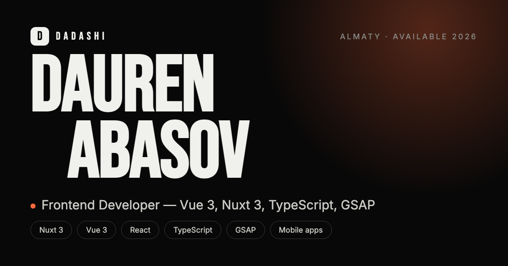

## Привет, я Даурен 👋

Frontend-разработчик из Алматы. Пишу на **Vue 3 и Nuxt 3** с TypeScript, держу
в рабочем состоянии легаси на Vue 2 / Vuex и беру задачи целиком — от вёрстки
макета до архитектуры стора и интеграции с API.

Больше всего люблю ту часть работы, где интерфейс начинает не просто работать,
а ощущаться: аккуратные переходы, честный скролл, отсутствие лишних спиннеров —
и чтобы всё это укладывалось в бюджет производительности.

## Стек

## Связаться

---

В этом репозитории лежит исходник моего портфолио — Nuxt 4, GSAP, three.js.
Как оно устроено и как запустить: **[DEVELOPMENT.md](DEVELOPMENT.md)**
